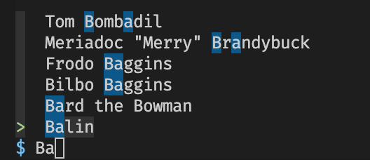

# fuzzy_finder

`fuzzy_finder` is a fuzzy finding UI for Rust CLI applications. 

Does your application have a big list of things your users want to search through? If so you might find this library helpful. It looks like this:



It comes with a Lord of the Rings example, which you can run like this:
```
cargo run --example lotr
```

## History

`fuzzy_finder` was developed for (lk)[https://github.com/jamescoleuk/lk].